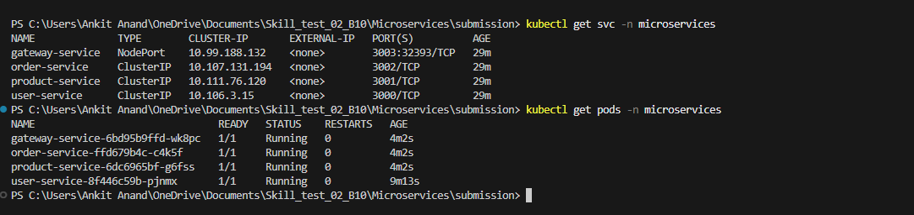
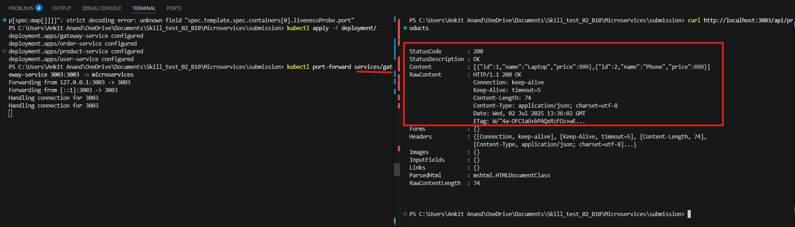
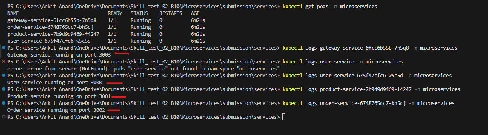

# Microservices Deployment with Minikube & Kubernetes

## Setting Up Minikube on Windows

### Step 1: Install Chocolatey

* Visit: [https://chocolatey.org/install](https://chocolatey.org/install)
* Copy and run the following command in **Command Prompt (Admin)**:
```powershell
Set-ExecutionPolicy Bypass -Scope Process -Force; \
[System.Net.ServicePointManager]::SecurityProtocol = \
[System.Net.ServicePointManager]::SecurityProtocol -bor 3072; \
iex ((New-Object System.Net.WebClient).DownloadString('https://community.chocolatey.org/install.ps1'))
```

### Step 2: Install kubectl (Kubernetes CLI)

* Visit: [https://kubernetes.io/docs/tasks/tools/install-kubectl-windows/](https://kubernetes.io/docs/tasks/tools/install-kubectl-windows/)
* Or directly run:
```bash
choco install kubernetes-cli
kubectl version --client
```

### Step 3: Setup .kube Directory

```bash
cd %USERPROFILE%
mkdir .kube
```

Create a file named `config.txt` in `.kube` directory (optional manual setup).

### Step 4: Install Minikube

* Visit: [https://minikube.sigs.k8s.io/docs/start/?arch=%2Fwindows%2Fx86-64%2Fstable%2F.exe+download](https://minikube.sigs.k8s.io/docs/start/?arch=%2Fwindows%2Fx86-64%2Fstable%2F.exe+download)
* Or install directly:

```bash
choco install minikube
```

### Step 5: Start Minikube Cluster

```bash
minikube start
```

---

## Change kubectl Context(bonus)

```bash
kubectl config get-contexts
kubectl config use-context <context-name>
notepad %USERPROFILE%\.kube\config
```

---

##  Steps to Deploy the App

### Step 1: Clone the Repository

```bash
git clone https://github.com/ankitanand200193/Skill_test_02_B10.git
cd Microservices
```

### Step 2: Create Dockerfiles and docker-compose

* 4 Dockerfiles (one per service)
* 1 `docker-compose.yml`

Build the images:

```bash
docker compose build
```

### Step 3: Push Docker Images to Docker Hub

```bash
docker push ankit200193/<service-name>:latest
```

### Step 4: Create Namespace in Kubernetes

```bash
kubectl create namespace microservices
```

### Step 5: Write Kubernetes Manifest Files

* Separate Deployment and Service YAMLs for each microservice.

### Step 6: Apply Manifest Files

```bash
kubectl apply -f <folder-name>/ -n microservices
```

#### Validating Pods & Services :




### Step 7: Test Services via Port Forwarding

```bash
kubectl port-forward services/user-service 3000:3000 -n microservices
kubectl port-forward services/product-service 3001:3001 -n microservices
kubectl port-forward services/order-service 3002:3002 -n microservices
kubectl port-forward services/gateway-service 3003:3003 -n microservices
```

### Access in Browser/Postman:

* [http://localhost:3000/users](http://localhost:3000/users) → user-service
* [http://localhost:3001/products](http://localhost:3001/products) → product-service
* [http://localhost:3002/orders](http://localhost:3002/orders) → order-service
* [http://localhost:3003/api/users](http://localhost:3003/api/users) → gateway-service

#### Gateway interacting with all services:



### View Logs

```bash
kubectl logs deployment/user-service -n microservices
```

#### Logs




---

## Frequently Asked Questions

### Q: Why is gateway-service using NodePort?

It acts as the **entry point** to your application and must be accessible from outside the cluster.

### Q: Why are user-service, product-service, and order-service using ClusterIP?

These are **internal microservices**, only accessed by the gateway.

## 🛠 Commonly Used Commands

```bash
kubectl delete pods --all -n <namespace>
kubectl port-forward service/user-service 3000:3000 -n <namespace>
kubectl apply -f <folder-name>/ -n <namespace>
kubectl logs -f deployment/user-service -n <namespace>
docker rmi ankit200193/gateway-service:latest
docker compose build
kubectl config get-contexts
kubectl delete deployments --all -n <namespace>
git push origin main --force
```
